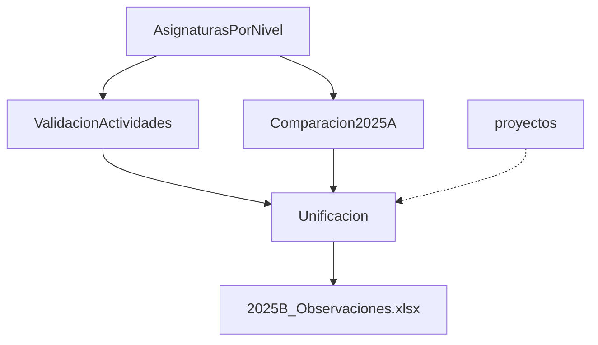

# Proyecto Preplanificación - Automatización Vicerrectorado de Docencia

Sistema automatizado para validación y análisis de la preplanificación académica del período 2025-B en el Vicerrectorado de Docencia.

## 📋 Descripción General

Este proyecto automatiza múltiples procesos manuales relacionados con la planificación académica, incluyendo:

- ✅ Validación de asignación de asignaturas por nivel y carrera
- ✅ Comparación de cargas horarias entre períodos académicos
- ✅ Verificación de actividades docentes obligatorias
- ✅ Cálculo de horas de proyectos de investigación
- ✅ Unificación de observaciones y generación de reportes finales

---

## 🗂️ Estructura del Proyecto

```
ProyectoPreplanificacion/
│
├── AsignaturasPorNivel/           # Extracción de códigos de asignaturas desde PDFs
│   ├── asignaturasPorNivel.ipynb  # Extracción y validación de mallas curriculares
│   ├── data/                      # PDFs de mallas curriculares + asignaturas.xlsx
│   └── outputs/                   # CSVs con códigos por carrera/nivel
│
├── ValidacionActividades/         # Verificación de actividades docentes obligatorias
│   └── verificacionActividades.ipynb
│
├── Comparacion2025A/              # Comparación de horas entre períodos 2025-A y 2025-B
│   ├── Comparador_Min_B_menor_A.ipynb
│   ├── data/
│   │   ├── 2025A.xlsx             # Datos del período 2025-A
│   │   └── 2025B.xlsx             # Datos del período 2025-B
│   └── outputs_notebook/
│       └── Reporte_B_menor_A.xlsx # Reporte de disminuciones de carga horaria
│
├── proyectos/                     # Análisis de proyectos de investigación
│   ├── proyectos.ipynb            # Versión completa con validación de horas aprobadas
│   └── proyectos2.ipynb           # Versión simplificada + join con docentes
│
└── Unificacion/                   # Consolidación de todos los análisis
    ├── 2025B_Observaciones_Preplanificacion.ipynb
    ├── data/
    │   ├── 2025B.xlsx             # Archivo maestro 2025-B
    │   ├── Reporte_B_menor_A.xlsx # Desde Comparacion2025A
    │   └── Reporte_actividades_3_4.xlsx # Desde ValidacionActividades
    └── outputs_notebook/
        └── 2025B_Observaciones.xlsx # REPORTE FINAL UNIFICADO
```

---

## 🔧 Requisitos del Sistema

### Python y Librerías

**Python**: 3.8 o superior

**Librerías requeridas**:
```bash
pip install pandas openpyxl xlrd xlsxwriter pdfplumber matplotlib seaborn numpy
```

**Detalle de librerías**:
- `pandas`: Manipulación y análisis de datos
- `openpyxl`: Lectura/escritura de archivos Excel (.xlsx)
- `xlrd`: Lectura de archivos Excel antiguos (.xls)
- `xlsxwriter`: Formato avanzado de archivos Excel
- `pdfplumber`: Extracción de texto desde archivos PDF
- `matplotlib` y `seaborn`: Visualización de datos (proyectos)
- `numpy`: Cálculos numéricos y manejo de fechas

---

## 📊 Módulos del Sistema

### 1. **AsignaturasPorNivel** - Extracción de Mallas Curriculares

**Propósito**: Extraer códigos de asignaturas desde PDFs de mallas curriculares y validar asignaciones docentes.

**Entrada**:
- PDFs de mallas curriculares (23 carreras en `data/`)
- `asignaturas.xlsx`: Asignaciones de profesores a asignaturas

**Proceso**:
1. Extrae códigos de asignaturas (formato: 4 letras + 3 dígitos, ej: `MATD113`) desde PDFs
2. Identifica el nivel (1-9) de cada asignatura usando coordenadas verticales
3. Genera CSVs individuales por carrera y un consolidado de todas las mallas
4. Valida que profesores no tengan conflictos de asignación (múltiples asignaturas del mismo nivel/carrera)

**Salida**:
- `outputs/malla_[carrera]_codigos_por_nivel.csv` (23 archivos)
- `outputs/todas_mallas_codigos.csv` (consolidado)
- `outputs/Reporte_AsignaturasPorNivel.xlsx` (validaciones con observaciones)

**Ejecución**:
```bash
jupyter notebook AsignaturasPorNivel/asignaturasPorNivel.ipynb
```

---

### 2. **ValidacionActividades** - Actividades Docentes Obligatorias

**Propósito**: Verificar que todos los docentes registren horas en las actividades obligatorias 3 y 4.

**Actividades obligatorias**:
- **Actividad 3**: "Preparación y actualización de clases, seminarios, talleres, entre otros"
- **Actividad 4**: "Preparación, elaboración, aplicación y calificación de exámenes, trabajos y prácticas; consultas académicas"

**Entrada**:
- Archivo Excel con planificación docente (columnas incluyen actividades 1-N)

**Proceso**:
1. Filtra docentes que tienen valores vacíos o ≤ 0 en actividades 3 o 4
2. Genera observaciones indicando cuál(es) actividad(es) no registran horas

**Salida**:
- `resultado_filtrado.xlsx`: Solo docentes con problemas + observaciones

**Ejecución**:
```bash
jupyter notebook ValidacionActividades/verificacionActividades.ipynb
```

---

### 3. **Comparacion2025A** - Comparación Entre Períodos

**Propósito**: Identificar docentes con **disminución** de carga horaria (clases dictadas) en 2025-B respecto a 2025-A.

**Entrada**:
- `data/2025A.xlsx`: Datos del período anterior
- `data/2025B.xlsx`: Datos del período actual

**Proceso**:
1. Suma horas de clases dictadas por Identificación (cédula)
2. Compara valores: identifica casos donde `cls_B < cls_A`
3. Calcula diferencia: `cls_A - cls_B`
4. Agrega observación estándar sobre reducción de carga horaria

**Salida**:
- `outputs_notebook/Reporte_B_menor_A.xlsx`:
  - Columnas: datos del docente + `cls_A`, `cls_B`, `diferencia`, `Observaciones`

**Observación generada**:
> "Se observa una disminución en la carga horaria de clases en el periodo 2025-B. Se recuerda que dicha reducción solo será válida en caso de que el departamento no solicite la incorporación de nuevo personal académico."

**Ejecución**:
```bash
jupyter notebook Comparacion2025A/Comparador_Min_B_menor_A.ipynb
```

---

### 4. **proyectos** - Análisis de Proyectos de Investigación

**Propósito**: Calcular horas semanales disponibles de proyectos de investigación durante el período académico.

#### **proyectos.ipynb** (Versión completa)

**Entrada**:
- Matriz de participantes en proyectos vigentes
- Archivo con datos de docentes (data 55.xlsx / 65.xlsx)

**Proceso**:
1. Calcula horas semanales: `horas_aprobadas / 24 semanas`
2. Define período académico 2025-B: `2025-09-01` a `2026-02-28`
3. Excluye feriados y días no laborables (lunes-viernes únicamente)
4. Calcula días laborables efectivos en el período
5. Recalcula horas disponibles según días efectivos
6. **Valida** si `horas_disponibles < horas_aprobadas` → Observación
7. Filtra docentes con actividad específica de investigación

**Salida**:
- DataFrame con columnas adicionales: `dias_disponibles`, `semanas_disponibles`, `horas_disponibles_periodo`, `observaciones`

#### **proyectos2.ipynb** (Versión simplificada)

**Diferencias**:
- Misma lógica de cálculo de horas
- **NO valida** horas disponibles vs aprobadas (código comentado)
- Hace `JOIN` entre proyectos y docentes por código de proyecto y nombre de profesor
- Más orientado a análisis exploratorio

**Recomendación**: Usar `proyectos.ipynb` para validaciones completas.

**Ejecución**:
```bash
jupyter notebook proyectos/proyectos.ipynb
```

---

### 5. **Unificacion** - Reporte Final Consolidado

**Propósito**: Unificar todos los análisis previos en un único archivo Excel con observaciones consolidadas.

**Entrada** (desde módulos anteriores):
- `data/2025B.xlsx` (archivo maestro completo)
- `data/Reporte_B_menor_A.xlsx` (desde Comparacion2025A)
- `data/Reporte_actividades_3_4.xlsx` (desde ValidacionActividades)

**Proceso**:
1. Lee el archivo maestro 2025B completo (todas las hojas)
2. **Join con métricas** (cls_A, cls_B, diferencia):
   - Prioridad: Identificación → Profesor → Profesor.1
3. **Join con actividades** (columnas de tareas + observaciones):
   - Prioridad: Identificación → Profesor → Profesor.1
4. Mantiene orden de columnas del maestro + agrega columnas calculadas
5. Genera dos columnas de observaciones:
   - `Observaciones_HorasClase`: Desde comparación de períodos
   - `Observaciones_Actividades1:1`: Desde validación de actividades

**Salida**:
- `outputs_notebook/2025B_Observaciones.xlsx`:
  - **Archivo final** con todos los datos + observaciones
  - Autofiltros habilitados
  - Encabezado congelado
  - Wrap text en columnas de observaciones

**Ejecución**:
```bash
jupyter notebook Unificacion/2025B_Observaciones_Preplanificacion.ipynb
```

---

## 🔄 Flujo de Ejecución Recomendado

Aunque los módulos son **semi-independientes**, el flujo óptimo es:



### Orden sugerido:

1. **AsignaturasPorNivel** (si hay PDFs nuevos de mallas)
   - Genera bases de datos de códigos por nivel/carrera
   - Valida asignaciones docentes

2. **ValidacionActividades**
   - Identifica docentes sin actividades obligatorias
   - Genera `Reporte_actividades_3_4.xlsx`

3. **Comparacion2025A**
   - Compara cargas horarias entre períodos
   - Genera `Reporte_B_menor_A.xlsx`

4. **proyectos** (opcional, según necesidad)
   - Análisis de proyectos de investigación
   - Validaciones de horas aprobadas vs disponibles

5. **Unificacion** ⭐ **(MÓDULO FINAL)**
   - Consolida todo en un único reporte
   - Genera `2025B_Observaciones.xlsx`

---

## 📝 Notas Importantes

### Rutas de Archivos
⚠️ **IMPORTANTE**: Los notebooks tienen rutas absolutas hardcodeadas. Debes ajustarlas según tu entorno:

```python
# Ejemplo en Comparacion2025A/Comparador_Min_B_menor_A.ipynb
excel_a = r"C:\Users\andra\Documents\8vo\Vice\automatizacion\ProyectoPreplanificacion\Comparacion2025A\data\2025A.xlsx"
```

**Recomendación**: Usar rutas relativas:
```python
excel_a = "data/2025A.xlsx"
excel_b = "data/2025B.xlsx"
```

### Formato de Fechas
- Los archivos Excel deben tener fechas en formato reconocible por pandas
- Feriados en proyectos usan `dayfirst=True` (formato dd/mm/yyyy)

### Identificadores de Docentes
El sistema usa múltiples formas de identificación:
- **Identificación** (cédula): Preferida para joins
- **Profesor** (nombre completo): Fallback
- **Profesor.1** (segundo campo de nombre): Último fallback

### Excepciones en AsignaturasPorNivel
Códigos excluidos de validación:
- Todos los que empiezan con `TITD`
- Lista extensa en el código (ver `EXCEPTION_CODES`)

---

## 🎯 Archivos Finales Clave

| Archivo | Descripción |
|---------|-------------|
| `Unificacion/outputs_notebook/2025B_Observaciones.xlsx` | **REPORTE FINAL** con todas las observaciones consolidadas |
| `Comparacion2025A/outputs_notebook/Reporte_B_menor_A.xlsx` | Docentes con reducción de horas |
| `AsignaturasPorNivel/outputs/Reporte_AsignaturasPorNivel.xlsx` | Validaciones de asignaciones por nivel |
| `AsignaturasPorNivel/outputs/todas_mallas_codigos.csv` | Consolidado de todas las mallas curriculares |

---

## 🐛 Solución de Problemas

### Error: "No such file or directory"
- Verifica que las carpetas `data/` existan en cada módulo
- Ajusta las rutas absolutas a tu entorno

### Error en pdfplumber
- Asegúrate de tener PDFs válidos (no escaneados)
- Verifica permisos de lectura en la carpeta `data/`

### Excel no se abre correctamente
- Instala `openpyxl`: `pip install openpyxl`
- Para archivos `.xls` antiguos: `pip install xlrd`

### Fechas incorrectas
- Revisa el parámetro `dayfirst` en `pd.to_datetime()`
- Verifica el formato de fechas en los archivos Excel de entrada

---

## 👨‍💻 Autor

**Vicerrectorado de Docencia**  
Automatización de procesos de preplanificación académica

---

## 📄 Licencia

Uso interno institucional
